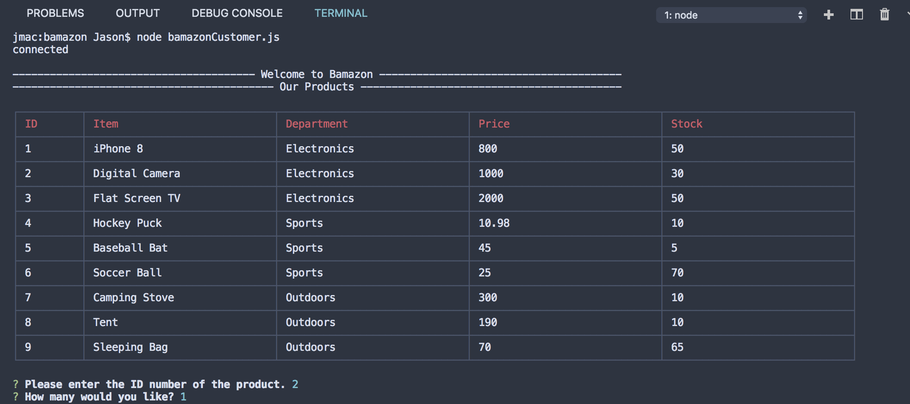
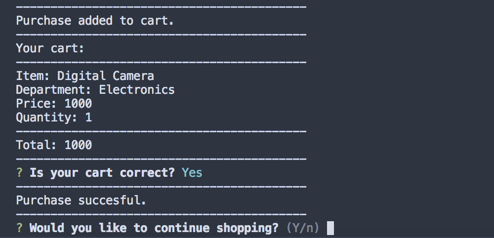

# bamazon

Bamazon is command line based store front similar to amazon.


## Running the app

- Clone this repository to your machine
- Download MySQL and a MySQL client. 
- Run the code from the bamazon.sql in your MySQL client
- In your terminal or command line change directory to the bamazon folder
- Run the following code in the terminal/command line:
    ```
    npm install
    ```


## Customer View

To run customer view simply type the following code into your terminal or command line and hit enter:
```
node bamazonCustomer.js
```
Once running customer view will display all the products on bamazon as well as their prices
and allow the user to purchase items from the store.


## Manager View

To run manger view type the following code into your terminal/command line and hit enter:
```
node bamazonManager.js
```

Manager view gives the user four options.

    - View products
    - View products with low inventory(Less than 50 in stock)
    - Add inventory to products
    - Add new products


## Demo

Here are some screenshots of the app in action:

Customer View #1


Customer View #2


Manager View #1


Manager View #2


Manager View #3


Manager View #4


Manager View #5

